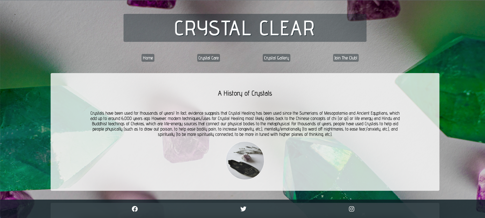

# Milestone Project 1 - Crystal Clear

This project was created to house a place for crystal fans. It includes a Homepage which holds information regarding crystals and how to choose the correct crystal for you. It also holds a Crystal care page which explains different methods of looking after your crystals. The Crystal Gallery displays images of several popular crystals. I have also included a Newsletter Subscription page, under the title of Join Us!

## Features

### UX 

The purpose of this project was to build a static (front-end only) website to celebrate crystals and their healing capabilities.

Gathered images from pexels.com.

Care for and store your crystals - https://www.mindbodygreen.com/articles/how-to-clean-store-program-your-crystals 

Beginners guide to crystals and how to use them - https://www.mindbodygreen.com/articles/types-of-crystals

About Crystals - Index Page - Credit to https://friendlyfamiliar.com/2022/08/21/crystals-101-a-beginners-guide/