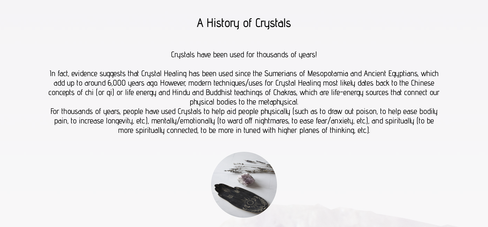
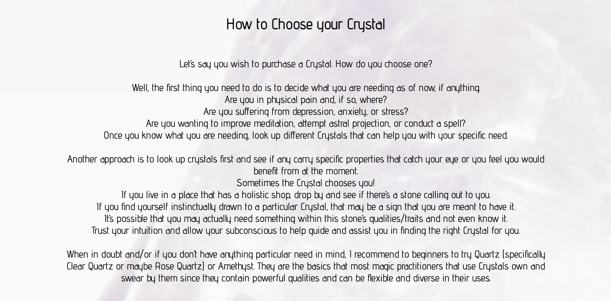
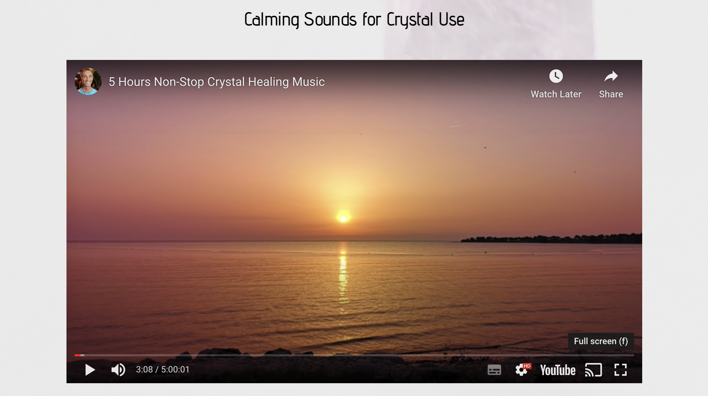

# Milestone Project 1 - Crystal Clear

The purpose of this project was to build a static (front-end only) website to celebrate crystals and their healing capabilities.

This project was created to house a place for crystal fans. It includes a Homepage which holds information regarding crystals and how to choose the correct crystal for you. It also holds a Crystal care page which explains different methods of looking after your crystals. The Crystal Gallery displays images of several popular crystals. I have also included a Newsletter Subscription page, under the title of Join Us!

## Features

### Navigation Bar

- The Navigation Bar is clearly labelled with titles leading to each different section of the Crystal Clear website. 
- Each title is displayed on all pages in an identical manner to ensure the user is able to navigate without issue.

### Crystal History Information Section

- This section is clearly labelled and the first point of access for each user. This is used to draw the users attention.
- This section also includes a small image to draw attention.

### Choose Your Crystal Section

- This section makes a more personalised experience for the user and allows them to build curiosity and a want to explore the website further.

### Calming Music Section

- This section plays calming music when clicked by the user.
- The section is responsive and adapts to each device. 
- The user can also choose to view in fullscreen. 

### Crystal Care Page

- The Crystal Care section is a list of ways to take care of your crystals.
- Includes a small image depicting a cleansing arrangement to assist users with their setup.
- Includes a responsive video which shows some ways to cleanse and charge crystals. 

### Gallery Page

- The gallery displays a list of images of crystals with a description of each below. 
- Each image, when clicked, directs to the wikipedia page for that specific crystal in a new tab. 

### Join Us! Page

- The Join Us! link is a sign up form for the Crystal Clear newsletter. 
- The form requests a required first name, last name and email address. 

Gathered images from pexels.com.

Care for and store your crystals - https://www.mindbodygreen.com/articles/how-to-clean-store-program-your-crystals 

Beginners guide to crystals and how to use them - https://www.mindbodygreen.com/articles/types-of-crystals

About Crystals - Index Page - Credit to https://friendlyfamiliar.com/2022/08/21/crystals-101-a-beginners-guide/